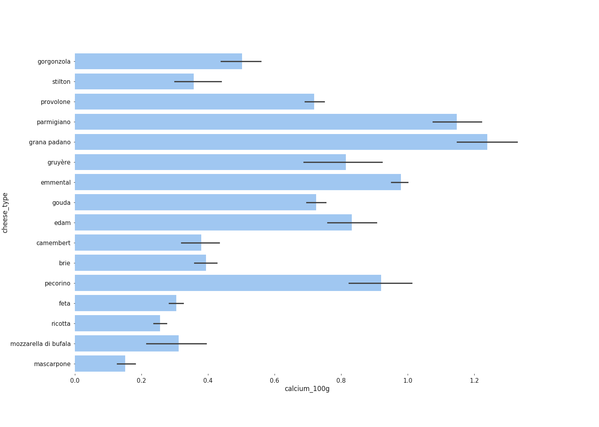

# Cheese Facts

## Introduction

As a cheese lover I would like to know which ones I should not eat too much of. We'll take a look at their fat and salt concentrations as well as other attributes that turn out to be interesting.

We would also like to know which cheese types contain less (or no) lactose if data in case that data is available.

## Dataset

This project is based on the Open Food Facts [dataset available on Kaggle](https://kaggle.com/openfoodfacts/world-food-facts).

[Open Food Facts](https://openfoodfacts.org) is a free, open, collaborative database of food products from around the world. It contains data on ingredients, allergens, nutrition facts and all the tidbits of information found on product labels.

The dataset is not provided in this repository and can be downloaded from [Kaggle](https://www.kaggle.com/openfoodfacts/world-food-facts/downloads/en.openfoodfacts.org.products.tsv).

## Approach

There are over 330 thousand entries in the dataset and for each of them there are 162 features. We started by taking a peak at the data and by figuring out which features could be interesting to analyze.

We noticed many of the features had mostly null values but that only made it hard to figure out each cheese type's lactose level. Here is the list of features we worked with:
- product_name
- fat_100g
- saturated-fat_100g
- cholesterol_100g
- sodium_100g
- salt_100g
- sugars_100g
- energy_100g
- proteins_100g
- calcium_100g
- vitamin-a_100g
- additives_n
- trans-fat_100g
- -lactose_100g

### Filtering cheese-only data

We then had to select products that were actually cheese and filter out everything else. We searched the `product_name` column for our favorite cheese types:

- gorgonzola
- stilton
- roquefort
- provolone
- parmigiano
- grana padano
- gruyère
- emmental
- gouda
- edam
- camembert
- brie
- pecorino
- feta
- ricotta
- mozzarella di bufala
- mascarpone

We took care to specifically choose only buffalo's mozzarella.

After applying that filter we still had about 10% of the whole dataset. We then filtered out non-cheese products that had cheese names in them (e.g., pizza, crêpe), and ended up with about 2200 cheese data points to work with.

### Enhancing the dataset with cheese-specific data

We wanted to make comparisons by cheese color, texture and milk source and so we decided to enhance the dataset with cheese-specific data.

All we did was to gather data from the Wikipedia pages related to the cheese types in the list above. For the sake of simplicity, cheese types with semi-soft and semi-hard textures were coded as having soft and hard textures, respectively.

Here is how it turned out:

|    cheese_type     |cheese_color|cheese_texture|  cheese_milk_source  |cheese_smoked|
|--------------------|------------|--------------|----------------------|------------:|
|gorgonzola          |blue        |soft          |cow                   |            0|
|stilton             |blue        |soft          |cow                   |            0|
|roquefort           |blue        |hard          |sheep                 |            0|
|provolone           |yellow      |hard          |cow                   |            1|
|parmigiano          |yellow      |hard          |cow                   |            0|
|grana padano        |yellow      |hard          |cow                   |            0|
|gruyère             |yellow      |hard          |cow                   |            0|
|emmental            |yellow      |hard          |cow                   |            0|
|gouda               |yellow      |hard          |cow                   |            0|
|edam                |yellow      |hard          |cow                   |            0|
|camembert           |yellow      |soft          |cow                   |            0|
|brie                |white       |soft          |cow                   |            0|
|pecorino            |white       |hard          |sheep                 |            0|
|feta                |white       |soft          |sheep&#124;goat            |            0|
|ricotta             |white       |soft          |cow&#124;sheep&#124;goat&#124;buffalo|            0|
|mozzarella di bufala|white       |fresh         |buffalo               |            0|
|mascarpone          |white       |creamy        |cow                   |            0|

## Findings

### Correlations between features

We made a plot to figure out which features were highly correlated with each other:

We could see high correlation between `fat_100g` and `saturated-fat_100g`, as well as between `salt_100g` and `sodium_100g`.

We then used linear regression plots to take a closer look at them:

This is a very high correlation showing us that for each 8g of fat there usually is about 5g of saturated fat.

This is a correlation with the Pearson coefficient set to 1, which indicates this is a perfect linear regression. For each 10g of salt there is about 3.5g of sodium.

Those high correlations made us realize it could be a good idea to analyze those features in pairs.

### Salt and sodium per 100g

*Note: in case the following plots look too small you can click on them to open their GitHub page and right-click the `Download` button and select to open it on a new tab/window.*

Here is the salt and sodium by cheese type plot. We can see that pecorino is by far the saltiest cheese type in our analysis. Roquefort comes second. Feta and gorgonzola complete the top 4. As expected, mascarpone has the least salt, followed by ricotta, mozzarella di bufala and emmental.

### Fat and saturated fat per 100g

Here is the fat and saturated fat by cheese type plot. We can see that mascarpone is the fattest cheese, also with the highest amounts of saturated fat. Roquefort comes second and Stilton third. Ricotta is by far the less fat cheese type, while feta comes second.

### Cheese color

Now, is it myth or fact that the more yellow the cheese the fatter it is?

Although mascarpone, pecorino and brie should bring the whites up, ricotta brings it down.

Although white and yellow cheeses seem very similar when it comes to salt, it is fair to say that blue cheese in general is saltier.

### Cheese textures

Just for fun, we decided to do the same for texture and source of milk.

It also became clear that creamy and fresh cheeses tend to have less salt and sodium than soft and hard ones, although the only creamy cheese type we have in our data is mascarpone and the only fresh type is mozzarella di bufala.

### Milk sources

To better analyze fat and salt with relation to milk source, we dropped the types of cheeses that have either varying or mixed milk sources.

As the only remaining cheese made of buffalo milk is mozzarella di bufala and the only remaining cheeses made of sheep milk are pecorino and roquefort, we were afraid not to have enough cheese type samples. We moved on and worked on the analysis but kept that in mind.

The major difference is regarding salt. As pecorino and roquefort are the 2 single saltiest cheese types in our analysis, it shows it cheese made of sheep milk tend to be saltier.

Buffalo milk cheese came as less salty, maybe because mozzarella di bufala is our only cheese type in that category.

### Aggregate data table with medians

We then decided to aggregate the data and calculate the medians for each feature. That is effective in removing outliers and it could give us a picture of how cheese types differ even for columns with a high number of null values.

|    cheese_type     |cheese_color|cheese_texture|  cheese_milk_source  |cheese_smoked|fat_100g|saturated-fat_100g|cholesterol_100g|sodium_100g|salt_100g|sugars_100g|energy_100g|proteins_100g|calcium_100g|vitamin-a_100g|additives_n|trans-fat_100g|-lactose_100g|
|--------------------|------------|--------------|----------------------|------------:|-------:|-----------------:|---------------:|----------:|--------:|----------:|----------:|------------:|-----------:|-------------:|----------:|-------------:|------------:|
|gorgonzola          |blue        |soft          |cow                   |            0|   28.57|             17.86|         0.08900|    0.95663|   2.4298|       0.00|     1494.0|        21.43|      0.5360|      0.000321|          0|             0|          NaN|
|stilton             |blue        |soft          |cow                   |            0|   35.00|             22.93|         0.08900|    0.78600|   1.9964|       0.10|     1644.0|        23.70|      0.3390|      0.000321|          0|             0|          NaN|
|roquefort           |blue        |hard          |sheep                 |            0|   32.00|             22.50|             NaN|    1.41732|   3.6000|       0.00|     1507.0|        19.00|         NaN|           NaN|          0|           NaN|          NaN|
|provolone           |yellow      |hard          |cow                   |            1|   28.12|             16.67|         0.07100|    0.85700|   2.1768|       0.00|     1494.0|        25.00|      0.7140|      0.000281|          0|             0|          NaN|
|parmigiano          |yellow      |hard          |cow                   |            0|   28.40|             20.00|         0.08900|    0.62992|   1.6000|       0.00|     1644.0|        32.40|      1.1600|      0.000214|          0|             0|          NaN|
|grana padano        |yellow      |hard          |cow                   |            0|   29.00|             18.00|         0.08900|    0.59055|   1.5000|       0.00|     1654.0|        33.00|      1.1650|      0.000214|          1|             0|          NaN|
|gruyère             |yellow      |hard          |cow                   |            0|   32.00|             19.00|         0.08900|    0.59055|   1.5000|       0.00|     1644.0|        27.00|      0.8930|      0.000321|          0|             0|          NaN|
|emmental            |yellow      |hard          |cow                   |            0|   29.00|             19.50|         0.08900|    0.27559|   0.7000|       0.10|     1561.0|        27.00|      1.0000|      0.000321|          0|             0|          0.1|
|gouda               |yellow      |hard          |cow                   |            0|   30.00|             19.05|         0.10000|    0.78740|   2.0000|       0.00|     1515.0|        25.00|      0.7140|      0.000261|          1|             0|          0.1|
|edam                |yellow      |hard          |cow                   |            0|   24.00|             16.00|         0.08900|    0.78870|   2.0033|       0.00|     1336.5|        25.00|      0.7500|      0.000321|          1|             0|          NaN|
|camembert           |yellow      |soft          |cow                   |            0|   22.00|             15.00|         0.07100|    0.62992|   1.6000|       0.50|     1169.0|        20.00|      0.3570|      0.000214|          0|             0|          0.1|
|brie                |white       |soft          |cow                   |            0|   29.50|             17.86|         0.08900|    0.59055|   1.5000|       0.03|     1473.0|        17.00|      0.3570|      0.000214|          0|             0|          NaN|
|pecorino            |white       |hard          |sheep                 |            0|   30.00|             20.00|         0.10000|    1.96625|   4.9943|       0.00|     1674.0|        25.00|      0.8000|      0.000000|          0|             0|          NaN|
|feta                |white       |soft          |sheep&#124;goat            |            0|   21.43|             14.29|         0.07100|    1.14300|   2.9032|       0.00|     1120.0|        17.86|      0.2860|      0.000214|          0|             0|          NaN|
|ricotta             |white       |soft          |cow&#124;sheep&#124;goat&#124;buffalo|            0|    9.68|              6.45|         0.04000|    0.12100|   0.3073|       3.23|      607.0|         9.68|      0.2420|      0.000145|          2|             0|          NaN|
|mozzarella di bufala|white       |fresh         |buffalo               |            0|   23.00|             16.00|         0.03600|    0.27559|   0.7000|       0.50|     1132.0|        14.00|      0.3120|      0.000000|          0|             0|          NaN|
|mascarpone          |white       |creamy        |cow                   |            0|   38.75|             25.75|         0.12500|    0.03600|   0.0914|       3.33|     1605.5|         5.30|      0.1430|      0.000429|          1|             0|          NaN|

### Calcium per 100g

Creating that aggregate table made us realize that it could also be interesting to analyze the amounts of calcium and proteins per cheese type.

We started with calcium. After removing roquefort, which didn't have any data point, and a couple of outliers that we judged were data entry errors, here is what we've found:

We can see that grana padano and parmigiano are the cheese types with the highest amounts of calcium, and also that cheeses with a hard texture tend to have more calcium than cheeses that are soft, fresh or creamy.

### Proteins per 100g

We can also see that hard cheeses tend to have more proteins, again with parmigiano and grana padano leading the way.

Moreover, soft, fresh and creamy cheeses tend to have less, in that order.

## Summary

If you are worried about salt consumption, stay away from pecorino and sheep cheese in general, and monitor the amount of blue cheese consumption. Creamy and fresh cheeses could be better choices, as well as emmental.

If you are mostly worried about fat, consider avoiding mascarpone and that delicious tiramisù. Blue cheese in general also tend be fatter. Ricotta is as lean as it gets. White, soft and buffalo cheeses might be a good option too, such as feta, camembert and mozzarella di bufala.

If you are looking for calcium and/or protein, look out for grana padano and parmigiano. Hard cheeses in general are a good option, whereas creamy ones won't have much to offer.
